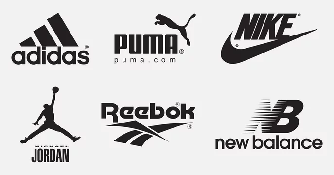

# Sentiment Analysis for Fashion Brands

## Overview

This repository contains the code and resources for a sentiment analysis project that examines customer reviews for two fashion brands, Adidas and Nike. The project aims to compare sentiment analysis outcomes using lexicon-based tools (TextBlob, SentiWordNet, and Vader) and categorize customer feedback based on their purchased items.


## Table of Contents

- [Project Objectives](#project-objectives)
- [Data](#data)
- [Code Structure](#code-structure)
- [Setup](#setup)
- [Usage](#usage)
- [Results](#results)
- [Contributing](#contributing)
- [License](#license)

## Project Objectives

The main objectives of this project are:

1. Perform a polarity-based comparative analysis using TextBlob, SentiWordNet, and Vader techniques for Adidas and Nike.
2. Compare sentiment analysis results for both brands.
3. Determine the preferred fashion brand based on positive and negative reviews.
4. Investigate the techniques used to categorize reviews using natural language toolkits.

## Data

The data used in this project is sourced from Kaggle and includes customer reviews for Adidas and Nike products.

## Code Structure

- `data/`: Contains the dataset used for the analysis.
- `notebooks/`: Jupyter notebooks for data preprocessing, analysis, and visualization.
- `scripts/`: Python scripts for sentiment analysis and data processing.
- `results/`: Folder to store the generated visualizations and analysis reports.

## Setup

To run this project locally, you will need Python 3.x and the following libraries:

- pandas
- nltk
- textblob
- seaborn
- matplotlib
- vaderSentiment

You can install these dependencies using the following command:

```bash
pip install pandas nltk textblob seaborn matplotlib vaderSentiment
